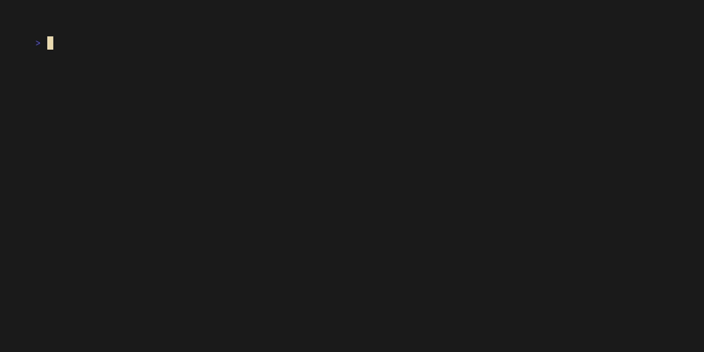
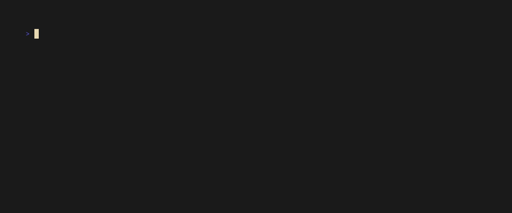
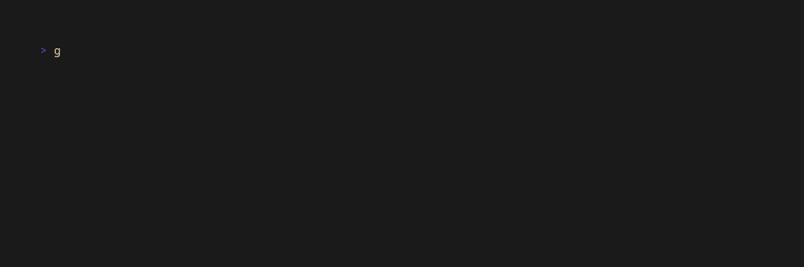
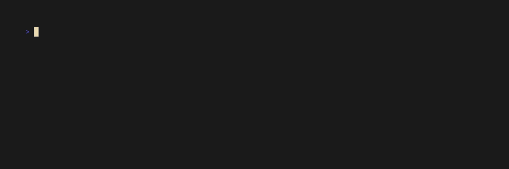
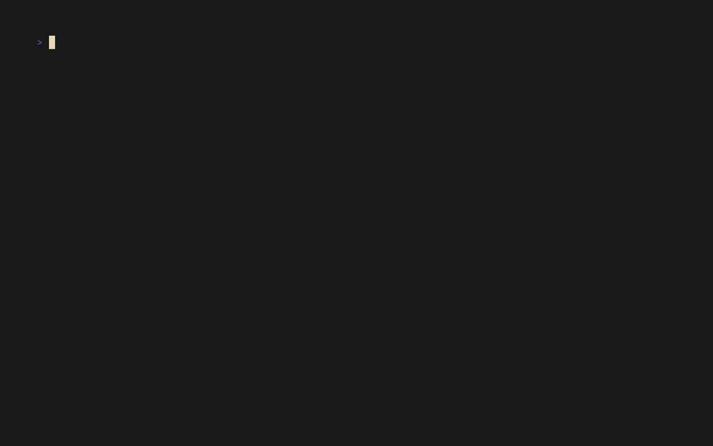
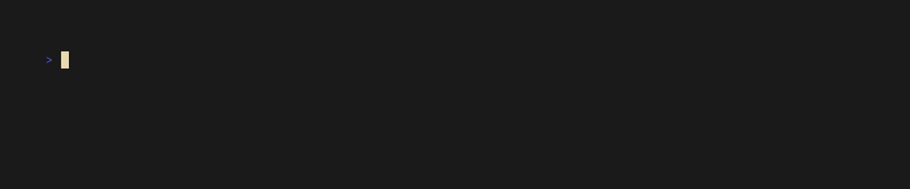

# go2web - CLI tool for Web Browsing

A fully functional, command-line based web browser and search tool written in C# (.NET 10 Native AOT). This project implements HTTP and HTTPS communication from scratch using raw TCP sockets, bypassing standard HTTP client libraries, and provides a rich terminal UI for reading web pages and searching the internet.

## Features

- **Raw HTTP over TCP Sockets:** Implements custom HTTP/1.1 communication using `System.Net.Sockets`, including HTTPS (TLS) support and Chunked Transfer Encoding.
- **Rich HTML Rendering:** Parses HTML documents and renders them cleanly in the terminal, complete with tables, lists, and formatted text, stripping out raw tags.
- **Web Search Integration:** Search the web using DuckDuckGo (default), Yahoo, or Brave, and interactively select a result to view.
- **Automatic Redirects:** Follows HTTP redirects (301, 302, 303, etc.) automatically, with configurable maximum redirect limits to prevent infinite loops.
- **HTTP Caching:** Implements a local caching mechanism that respects `ETag`, `Last-Modified`, and `Expires` headers, using conditional requests (`If-None-Match`) to save bandwidth.
- **Content Negotiation:** Supports custom `Accept` and `Accept-Language` headers, automatically pretty-printing JSON responses when requested.
- **Cross-Platform:** Compiles to Native AOT for standalone executables on Linux, macOS, and Windows.

---

## Installation

You can install `go2web` using the provided installation scripts:

Linux/macOS:
```bash
curl -fsSL https://raw.githubusercontent.com/.../installers/install.sh | bash
```

Windows (PowerShell):
```powershell
irm https://raw.githubusercontent.com/.../installers/install.ps1 | iex
```



---

## Usage

### Help Command
Use the `-h` or `--help` flag to see all available commands and options.


### Fetching a URL (`-u`)
Make an HTTP request to a specified URL and read the response in a human-readable format.


**Content Negotiation & Headers:**
You can request specific content types (like JSON) and languages, or view the raw response headers.
- Accept specific content: 
- Request specific language: 
- View response headers: 

### Web Search (`-s`)
Search the web for a specific term and interactively pick a result to view directly in the terminal.



**Search Engines:**
Choose between DuckDuckGo, Yahoo, or Brave using the `--engine` flag.


### Redirect Handling
The client automatically follows redirects to get you to the final destination.


You can also limit the number of redirects to prevent loops using the `--redirects` flag.


### HTTP Caching
The application caches responses and revalidates them with the server using ETags, speeding up subsequent requests to the same URL.


### Configuration
Open the global configuration file to set default search engines, max redirects, etc.


---

## Tools and Libraries

- [Spectre.Console](https://github.com/spectreconsole/spectre.console) - For building rich terminal UIs with tables, prompts, and formatted text.
- [ConsoleAppFramework](https://github.com/Cysharp/ConsoleAppFramework) - For structuring the command-line application with subcommands and options.
- [AngleSharp](https://github.com/AngleSharp/AngleSharp) - For parsing HTML documents and extracting content for terminal rendering.
- [vhs](https://github.com/charmbracelet/vhs) - For recording terminal sessions and generating GIFs for documentation.
